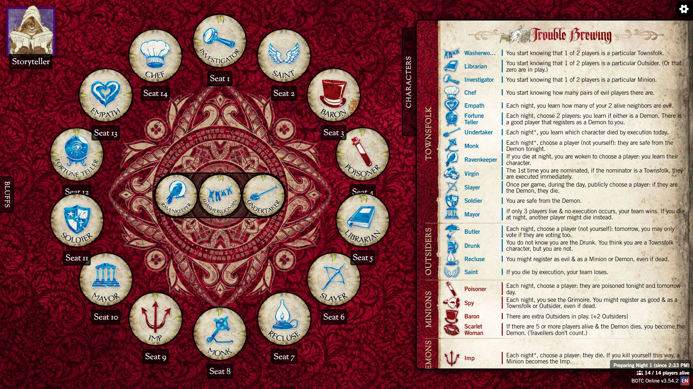

# 🕵️ RustWebScraper + 🩸 BotC CLI

> A dual-binary Rust toolkit for web scraping and Blood on the Clocktower game management — built on headless Chrome, SQLite, and a clean CLI interface.

---

## Background

My partner and I are board game obsessives. We collect all kinds of games on the shelves of our dedicated game room, and we invite a myriad of friends and collegues over to play them every month. Our most recent and most intense obsession is with Blood on the Clocktower, a social deduction game in the likes of Werewolf and Mafia, where a secret team of "evil" players try to deceive and divide their good neighbors into turning on each other. We have hosted several Clocktower game nights, each filled with hours of laughter, mystery, and suspense. The most prominent way for us and like-minded fans to play the game is in the online web app: **https://botc.app**  



While exceptional at recreating the joy of the game in a digital format, I find the official app lacking in a few ways that I hope to address with this project.
1. Taking custom notes to track crucial information within a game is clunky and difficult to achieve
2. There is no built-in way to save a reference to a player's game state, meaning an extra great game can never be looked back at or re-lived outside of our individual memories.

My vision for this project is to be able to back-up and retrieve pieces of my favorite clocktower games. This could either be from my own perspective, so I can realize after the fact I had the critical information to solve the game right under my nose the whole time, or from another player's entirely different experience in the same game. _How did the demon player decide to bluff that specific role to me right then and there?_

---

## What's Inside

This is a WIP project. The goal is to eventually allow users to create, store, and retrieve custom note templates corresponding to specific gsme states scraped from the Blood on the Clocktower web app. Currently, it ships **two standalone binaries** that share a single SQLite database:

| Binary | Purpose |
|--------|---------|
| `rustscraper` | General-purpose HTML scraper — static pages and JavaScript SPAs |
| `botc` | Blood on the Clocktower role database and game session manager |

---

## Features

### `rustscraper`
- **Static HTML scraping** via plain HTTP — fast, zero overhead
- **JavaScript SPA scraping** via headless Chrome — renders React, Vue, Angular before extraction
- **Authenticated sessions** — inject cookies and/or `localStorage` tokens before navigation (supports Firebase, JWT, session cookies)
- **Anti-detection** — suppresses `navigator.webdriver`, uses Chrome's `--headless=new` engine
- **CSS selector extraction** — `--select "h1:title"` syntax, supports pseudo-selectors like `a:first-child`
- **Configurable render wait** — tune `--wait-ms` for slow-loading SPAs
- **Raw HTML dump** — `--dump-html` prints the rendered source for selector discovery
- **SQLite persistence** — every scrape stored with URL, timestamp, and all extracted fields
- **JSON export** — pretty-printed output to file or stdout, pipeable to `jq`

### `botc`
- **Bulk role sync** — pulls all editions and roles from the BotC JSON API in one command
- **Idempotent upserts** — safe to re-run when your auth token refreshes; no duplicates
- **Role querying** — filter by team (`demon`, `minion`, `townsfolk`, …) or edition (`tb`, `bmr`, `snv`)
- **Game session storage** — record a 3–20 role game, get back a persistent game ID
- **Rich game display** — retrieve any game with full role names, teams, editions, and abilities joined from the role database

---

## Requirements

- **Rust** 1.70+ (`cargo build`)
- **Google Chrome** installed (required for `rustscraper --js` only)
- No system SQLite needed — compiled from source via `rusqlite`'s `bundled` feature

---

## Build

```bash
cargo build --release
```

Binaries land in `target/release/rustscraper` and `target/release/botc`.

First build takes 2–4 minutes on Windows (compiles bundled SQLite + TLS).

---

## `rustscraper` Usage

### Scrape a static page

```bash
rustscraper scrape https://example.com \
  --select "h1:title" \
  --select "p:intro"
```

```
Fetching https://example.com ...
Stored record #1 with 2 field(s):
  title: Example Domain
  intro: This domain is for use in illustrative examples...
```

### Scrape a JavaScript SPA

```bash
rustscraper scrape https://someapp.com/dashboard \
  --js \
  --wait-ms 4000 \
  --select ".user-name:name" \
  --select ".balance:balance"
```

### Authenticated scraping

```bash
# Cookie-based auth (copy Cookie header from Chrome DevTools → Network tab)
rustscraper scrape https://botc.app/play \
  --js \
  --cookie "session=abc123; __cf_bm=xyz" \
  --select ".player-name:player"

# localStorage-based auth (copy from DevTools → Application → Local Storage)
rustscraper scrape https://app.example.com \
  --js \
  --local-storage "authToken=eyJhbGci..." \
  --select ".dashboard-title:title"

# Both at once
rustscraper scrape https://app.example.com \
  --js \
  --cookie "cf=xyz" \
  --local-storage "authToken=eyJ..." \
  --select ".player:name"
```

### Discover selectors with `--dump-html`

```powershell
# Dump the JS-rendered DOM to a file for inspection
rustscraper scrape https://botc.app/play --js --dump-html `
  | Out-File -Encoding utf8 rendered.html
```

> **Note:** Use `Out-File -Encoding utf8` instead of `>` — PowerShell's default redirect writes UTF-16.

### List stored results

```bash
rustscraper list
rustscraper list --url https://example.com
```

```
ID     URL                                                SCRAPED AT                     FIELDS
--------------------------------------------------------------------------------------------------------------
1      https://example.com                                2026-05-17T20:37:43+00:00      title=Example Domain, intro=This domain...
```

### Export to JSON

```bash
rustscraper export --output results.json
rustscraper export | jq '.[0].fields'
```

```json
[
  { "name": "title", "value": "Example Domain" },
  { "name": "intro",  "value": "This domain is for use in illustrative examples..." }
]
```

---

## `botc` Usage

### Sync roles from the API

The BotC API requires a short-lived JWT token (~30 min expiry). Grab it from Chrome DevTools → Network → any `/backend/` request → `Authorization` header.

```bash
botc api https://botc.app/backend/data \
  --token eyJhbGci... \
  --cookie "__cf_bm=abc123"
```

```
Fetching https://botc.app/backend/data ...
Stored 6 editions and 214 roles.
```

### Query roles

```bash
# All roles
botc roles

# Filter by team
botc roles --team demon
botc roles --team minion

# Filter by edition
botc roles --edition tb
botc roles --edition bmr --team townsfolk
```

```
NAME                 TEAM         EDITION    ABILITY
----------------------------------------------------------------------------------------------------
Imp                  demon        tb         Each night*, choose a player: they die. If you ki...
Po                   demon        bmr        Each night*, you may choose a player: they die. I...
Shabaloth            demon        bmr        Each night*, choose 2 players: they die. The prev...
```

### List editions

```bash
botc editions
```

```
ID         NAME                      LEVEL        OFFICIAL
------------------------------------------------------------
bmr        Bad Moon Rising           intermediate yes
snv        Sects & Violets           intermediate yes
tb         Trouble Brewing           beginner     yes
```

### Create a game session

```bash
botc new-game \
  --role imp \
  --role spy \
  --role baron \
  --role washerwoman \
  --role chef \
  --role empath \
  --role soldier \
  --role monk
```

```
Game #1 created with 8 roles:
  1. imp
  2. spy
  3. baron
  4. washerwoman
  5. chef
  6. empath
  7. soldier
  8. monk
```

### Retrieve a game

```bash
botc get-game 1
```

```
Game #1 — created 2026-05-18T00:55:26+00:00
----------------------------------------------------------------------
#    NAME                 TEAM         EDITION    ABILITY
----------------------------------------------------------------------
1    Imp                  demon        tb         Each night*, choose a player: they die...
2    Spy                  minion       tb         Each night, you see the Grimoire...
3    Baron                minion       tb         When setting up the game, add two Outsiders...
4    Washerwoman          townsfolk    tb         You start knowing that 1 of 2 players is a...
5    Chef                 townsfolk    tb         You start knowing how many pairs of evil...
6    Empath               townsfolk    tb         Each night, you learn how many of your 2...
7    Soldier              townsfolk    tb         You are safe from the Demon...
8    Monk                 townsfolk    tb         Each night*, choose a player (not yourself)...
```

---

## Database

Both binaries share a single SQLite file (`scrapes.db` by default). Use `--db <path>` on either binary to point at a different file.

```
scrapes     — one row per scrape job (url, timestamp)
fields      — key/value pairs extracted from a scrape
editions    — BotC editions keyed by short ID (e.g. "tb")
roles       — BotC character roles with full metadata
games       — game sessions with creation timestamp
game_roles  — ordered role membership for a game
```

Override the database path:

```bash
rustscraper --db mydata.db scrape https://example.com --select "h1:title"
botc --db mydata.db roles --team demon
```

---

## Command Reference

### `rustscraper`

| Flag / Argument | Description |
|-----------------|-------------|
| `--db <path>` | SQLite file path (default: `scrapes.db`) |
| `scrape <url>` | URL to fetch |
| `--select SELECTOR:FIELD` | CSS selector + output name. Repeatable. Splits on last `:` |
| `--js` | Enable headless Chrome rendering |
| `--wait-ms <ms>` | Wait after page load before capture (default: `3000`) |
| `--cookie <value>` | Full `Cookie` header string for auth injection |
| `--local-storage KEY=VALUE` | localStorage entry to inject. Repeatable |
| `--dump-html` | Print raw/rendered HTML instead of extracting |
| `list [--url <filter>]` | List stored results |
| `export [--output <file>]` | Export to JSON |

### `botc`

| Flag / Argument | Description |
|-----------------|-------------|
| `--db <path>` | SQLite file path (default: `scrapes.db`) |
| `api <url> [--token T] [--cookie C]` | Sync editions and roles from API |
| `roles [--team T] [--edition E]` | List roles with optional filters |
| `editions` | List editions |
| `new-game --role ID ...` | Create game (3–20 roles, repeatable) |
| `get-game <id>` | Retrieve game with full role details |

---

## Tech Stack

| Crate | Role |
|-------|------|
| [`clap`](https://docs.rs/clap) | CLI argument parsing (derive macros) |
| [`reqwest`](https://docs.rs/reqwest) | Blocking HTTP client |
| [`scraper`](https://docs.rs/scraper) | HTML parsing + CSS selector engine |
| [`chromiumoxide`](https://docs.rs/chromiumoxide) | Chrome DevTools Protocol — headless browser control |
| [`tokio`](https://docs.rs/tokio) | Async runtime (required by chromiumoxide) |
| [`rusqlite`](https://docs.rs/rusqlite) | SQLite bindings (bundled — no system lib needed) |
| [`serde`](https://docs.rs/serde) / [`serde_json`](https://docs.rs/serde_json) | JSON serialization |
| [`anyhow`](https://docs.rs/anyhow) | Ergonomic error propagation |
| [`chrono`](https://docs.rs/chrono) | RFC 3339 timestamps |
